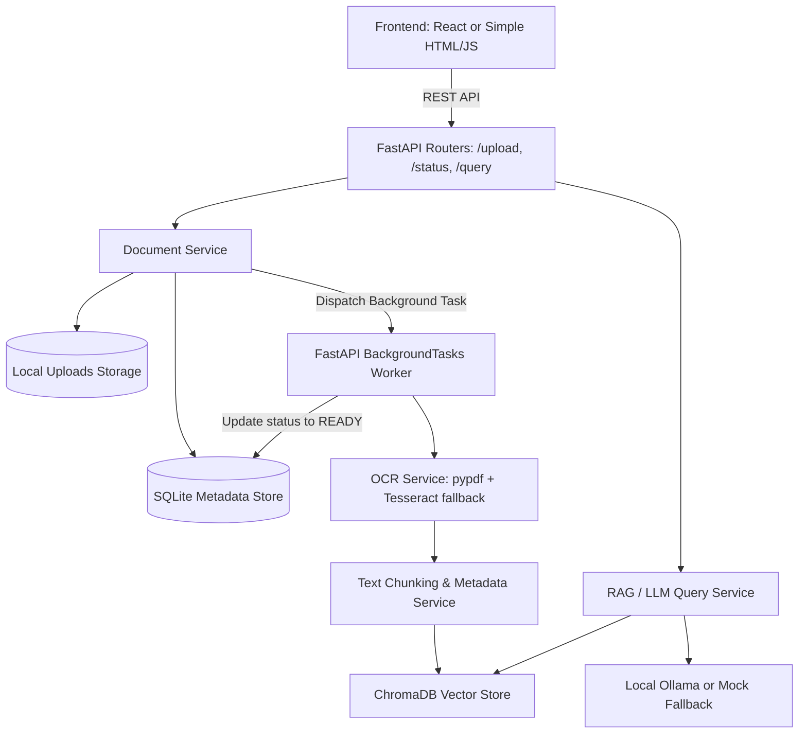
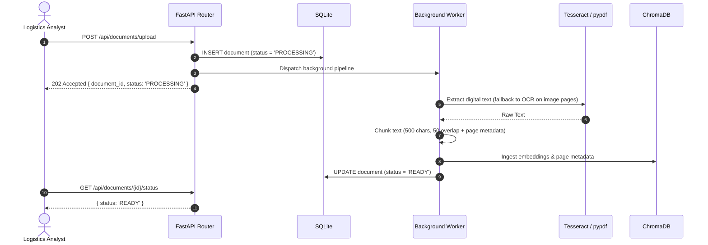

# LogiPro Document Intelligence Service

Local-first prototype for asynchronous extraction and natural-language querying
of shipping PDFs and images.

## System Architecture

### Component Architecture


### Data Flow & Execution Sequence


## Design Decisions & Trade-offs

| Decision | Selected Approach | Trade-off / Rationale |
| --- | --- | --- |
| **Task Queue** | **FastAPI `BackgroundTasks`** | Chosen for prototype simplicity and zero-infrastructure overhead. It requires no external message broker (RabbitMQ/Redis) or extra container services. *Trade-off:* Tasks run in-process; unhandled restarts during processing can leave tasks uncompleted. Production should decouple this via Celery. |
| **Metadata & Vector Storage** | **SQLite + Local ChromaDB** | Embeds cleanly into a single container filesystem (`/app/data`) with zero cloud database dependencies, fast initialization, and straightforward backup via simple volume mounts. *Trade-off:* Single-node scale limits concurrency compared to managed cluster databases. |
| **Local Embeddings** | **`sentence-transformers/all-MiniLM-L6-v2`** | 100% free, runs entirely offline on CPU/GPU without cloud API keys, and pre-caches in the Docker build to avoid runtime network downloads. *Trade-off:* Moderate inference latency compared to dedicated remote GPU endpoints. |
| **Text Extraction & OCR** | **`pypdf` with `pypdfium2` / Tesseract OCR fallback** | Prioritizes high-speed digital text parsing via `pypdf`. Automatically falls back to high-fidelity PDF rendering via `pypdfium2` and Tesseract OCR only for scanned/image-heavy pages or frame images. *Trade-off:* CPU-intensive rasterization for very large scanned multi-page documents. |

## Production Scaling Roadmap

To transition this single-container prototype into an enterprise-grade production platform for LogiPro Solutions:

1. **Decoupled Asynchronous Workers (Celery + RabbitMQ)**:
   - Extract document ingestion, OCR, and embedding generation from FastAPI's in-process background worker into dedicated Celery workers backed by a RabbitMQ broker.
   - Run heavy OCR and embedding workers on auto-scaling Kubernetes worker nodes with GPU acceleration (NVIDIA TensorRT / CUDA) to process high volumes of shipping manifests simultaneously.
2. **Enterprise Database & Vector Scaling (PostgreSQL + `pgvector`)**:
   - Migrate document metadata and embeddings from SQLite and local ChromaDB into PostgreSQL with the `pgvector` extension.
   - Enables unified ACID transactions, relational joins between document manifests and shipping logistics tables, row-level security, and horizontal read replica scaling.
3. **Cloud-Native Object Storage (AWS S3 / MinIO)**:
   - Replace the local filesystem uploads mount with distributed S3-compatible object storage featuring presigned URLs, lifecycle policies, and server-side encryption.
4. **Resilient Job Recovery & Distributed Tracing**:
   - Add state reconciliation workers that identify and retry stale `PROCESSING` jobs.
   - Introduce OpenTelemetry distributed tracing across API, message queue, and OCR tasks.

## AI Agents & Development Process

In accordance with the project instructions, this service was architected, scaffolded, and iteratively implemented in collaboration with **Cline** (AI coding agent in VS Code). Development was driven systematically across discrete milestones: system architecture, database state management, asynchronous OCR/chunking pipelines, RAG retrieval with citations, and frontend user workflows.

**Models Utilized:**
- **GPT 5.6 SOL**: Initial system architecture design, service-layer separation, and design decisions.
- **Gemini flash 3.8**: Rapid implementation, test suite generation, text normalization, and iterative bug fixing.

**Audit & Conversation Records:**
- Human-readable transcript: [`ai_logs/AI_CONVERSATION.md`](./ai_logs/AI_CONVERSATION.md)
- Raw execution payloads & tool traces: [`ai_logs/cline_logs.json`](./ai_logs/cline_logs.json)
- Additional methodology notes: [`ai_logs/README.md`](./ai_logs/README.md)

## Implemented milestones

The service currently includes:

- A FastAPI application factory and composed routers.
- Pydantic v2 contracts for upload, status, and query workflows.
- Service-layer boundaries that keep business logic out of route handlers.
- A functional health check and OpenAPI documentation.
- Single-service Docker Compose scaffolding and persistent local data mounts.
- SQLite-backed document metadata and status lookup.
- Streamed local persistence for validated PDF and image uploads.
- FastAPI background ingestion after a successful upload.
- Per-page digital PDF extraction with Tesseract fallback for scanned pages.
- Page-aware overlapping text chunks and local sentence-transformer embeddings.
- Persistent local ChromaDB vector storage with citation-ready metadata.
- Document-scoped semantic search with page-numbered source citations.
- Optional local Ollama answers with an immediate grounded mock fallback.

No paid API key or hosted inference service is required.

The responsive browser interface is served directly by FastAPI from the same
container and origin as the API. It provides upload progress, automatic status
polling, a Q&A workspace that unlocks at `READY`, and page-numbered citations.

## Upload lifecycle

`POST /api/documents/upload` accepts the following matching filename extensions
and media types:

- PDF (`.pdf`, `application/pdf`)
- JPEG (`.jpg` or `.jpeg`, `image/jpeg`)
- PNG (`.png`, `image/png`)
- TIFF (`.tif` or `.tiff`, `image/tiff`)
- BMP (`.bmp`, `image/bmp` or `image/x-ms-bmp`)
- WebP (`.webp`, `image/webp`)

Accepted files are saved under `data/uploads` using a generated UUID filename.
Their original safe filename, server path, `PROCESSING` status, optional error,
and UTC timestamps are recorded in `data/documents.sqlite3`. After returning
`202 Accepted`, a FastAPI background task extracts and indexes the document. The
status endpoint reads the persisted record and returns `404` for unknown IDs.

The processing task transitions documents as follows:

```text
PROCESSING -> READY
           -> FAILED (with an error_message)
```

PDF pages first use `pypdf`. Pages with little or no digital text are rendered
locally and sent to Tesseract. Images, including multi-frame TIFF files, use
Tesseract directly. Text is split into 500-character chunks with 50-character
overlap without crossing page boundaries. Chroma metadata contains the document
ID, original filename, page number, chunk index, offsets, and extraction method.

The default local embedding model is
`sentence-transformers/all-MiniLM-L6-v2`; the Docker build caches it in the image
so processing does not need to download a model after startup.

## Ask questions

Only documents with status `READY` can be queried. `PROCESSING` and `FAILED`
documents return `409 Conflict`, and unknown IDs return `404 Not Found`.

The target Ollama model can be configured directly per-request from the input field
on the right side of the UI navigation bar, or overridden programmatically in the
JSON request body using the `"model"` field (e.g. `"model": "mistral:7b"`). If omitted,
it defaults to `LOGIPRO_OLLAMA_MODEL` (`llama3.2`).

```bash
curl -X POST http://localhost:8000/api/documents/DOCUMENT_ID/query \
  -H "Content-Type: application/json" \
  -d '{"question":"What is the gross shipment weight?","top_k":5,"model":"llama3.2"}'
```

The response includes the generated answer and the retrieved source chunks:

```json
{
  "document_id": "...",
  "question": "What is the gross shipment weight?",
  "answer": "The gross shipment weight is 2500 kg [1].",
  "citations": [
    {
      "chunk_id": "...:p0002:c0000",
      "page_number": 2,
      "text": "Gross shipment weight: 2500 kg",
      "relevance_score": 0.91
    }
  ],
  "llm_provider": "mock",
  "used_fallback": true
}
```

### LLM modes

`LOGIPRO_LLM_MODE` supports:

- `auto` (default): try Ollama, then use the grounded mock fallback if Ollama is
  unavailable or returns an invalid response.
- `mock`: skip Ollama and immediately return an extractive answer from the most
  relevant source chunks. This is the fastest reviewer setup.
- `ollama`: require Ollama and return `503 Service Unavailable` if it cannot be
  reached.

To force immediate fallback mode:

```bash
LOGIPRO_LLM_MODE=mock docker compose up --build
```

To use Ollama, run it on the host and install the configured model, for example:

```bash
ollama pull llama3.2
ollama serve
docker compose up --build
```

Compose points the application at `http://host.docker.internal:11434`. For local
Python development outside Docker, the default is `http://localhost:11434`.

## Run with Docker

```bash
docker compose up --build
```

Then visit:

- Browser interface: <http://localhost:8000/>
- API metadata: <http://localhost:8000/api/info>
- Health check: <http://localhost:8000/api/health>
- Swagger UI: <http://localhost:8000/docs>

Stop the application with:

```bash
docker compose down
```

## Local development

```bash
python -m venv .venv
# Windows: .venv\Scripts\activate
pip install -r requirements-dev.txt
uvicorn app.main:app --reload
pytest
```

## Project structure

```text
app/
  api/            # Thin route handlers and dependency providers
  core/           # Environment-driven configuration
  models/          # Internal document domain types
  repositories/   # SQLite persistence adapters
  schemas/        # Pydantic request and response models
  services/       # Upload, extraction, chunking, embedding, vector, and RAG services
frontend/         # Same-origin HTML, CSS, and JavaScript interface
data/
  uploads/        # Uploaded source documents
  chroma/         # Persistent ChromaDB data
tests/            # API smoke and contract tests
compose.yaml
Dockerfile
```

## API contracts

- `POST /api/documents/upload`
- `GET /api/documents/{document_id}/status`
- `POST /api/documents/{document_id}/query`

Configuration is read from environment variables prefixed with `LOGIPRO_`. For
example, `LOGIPRO_DATA_DIR=/app/data` selects the container's persistent data
directory.

Useful ingestion settings include:

| Variable | Default |
| --- | --- |
| `LOGIPRO_OCR_LANGUAGE` | `eng` |
| `LOGIPRO_OCR_TIMEOUT_SECONDS` | `60` |
| `LOGIPRO_OCR_PDF_DPI` | `200` |
| `LOGIPRO_OCR_FALLBACK_MIN_CHARACTERS` | `20` |
| `LOGIPRO_TEXT_CHUNK_SIZE` | `500` |
| `LOGIPRO_TEXT_CHUNK_OVERLAP` | `50` |
| `LOGIPRO_EMBEDDING_MODEL` | `sentence-transformers/all-MiniLM-L6-v2` |
| `LOGIPRO_EMBEDDING_DEVICE` | `cpu` |
| `LOGIPRO_EMBEDDING_BATCH_SIZE` | `32` |
| `LOGIPRO_CHROMA_COLLECTION_NAME` | `logipro_document_chunks` |
| `LOGIPRO_CHROMA_BATCH_SIZE` | `100` |
| `LOGIPRO_LLM_MODE` | `auto` |
| `LOGIPRO_OLLAMA_BASE_URL` | `http://localhost:11434` |
| `LOGIPRO_OLLAMA_MODEL` | `llama3.2` |
| `LOGIPRO_OLLAMA_CONNECT_TIMEOUT_SECONDS` | `1` |
| `LOGIPRO_OLLAMA_RESPONSE_TIMEOUT_SECONDS` | `120` |
| `LOGIPRO_OLLAMA_TEMPERATURE` | `0.1` |
| `LOGIPRO_OLLAMA_MAX_TOKENS` | `512` |

The supplied image installs Tesseract's English language data. To use another
`LOGIPRO_OCR_LANGUAGE`, add its Debian Tesseract language package to the
`Dockerfile`.

> **Prototype limitation:** FastAPI background tasks execute in the API process
> after the response. They are not a durable job queue. Restarting the container
> during ingestion can leave a document in `PROCESSING`; a production deployment
> should add stale-job recovery or a durable worker queue.