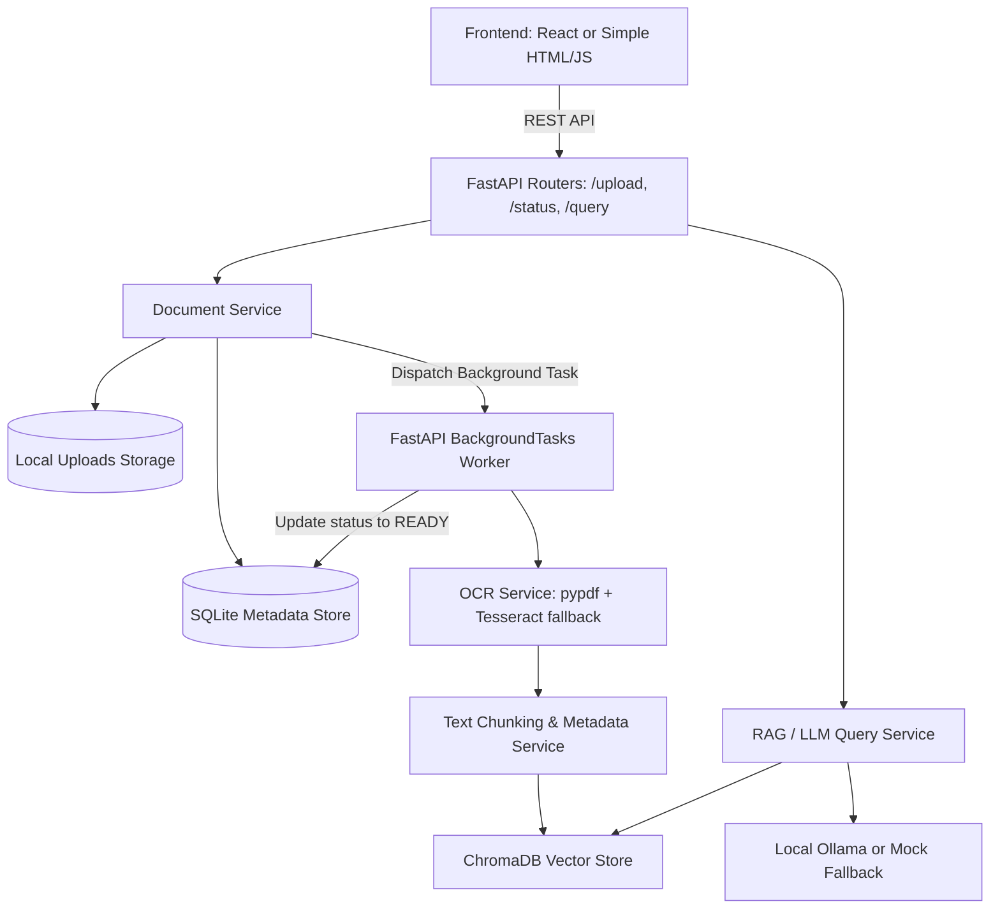
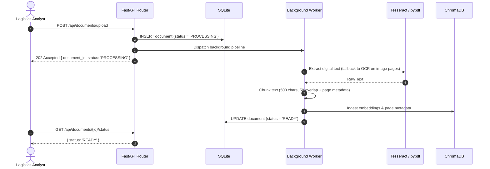

# AI Assisted Development Log

> Tool: Cline (VS Code) using Anthropic / OpenRouter

---

### 👤 Phase Prompt 1

Hi Cline. I need to build a prototype Document Intelligence Service for LogiPro Solutions.
The goal is to let users upload shipping PDFs and images, extract text asynchronously (using OCR when needed), and ask natural-language questions about the documents using local embeddings and an LLM.
Here is the system architecture and data flow I designed:




Core rules for this build:
Everything must run in a single container using docker-compose up.
Do not require any paid API keys. Use sentence-transformers for local embeddings, and provide a fallback mode if Ollama is not running.
Use a clean Service Layer pattern (separate routers, services, schemas). Keep business logic out of the route handlers.
Keep the frontend simple and functional.
Let's build this step-by-step. First, create the project folder structure, Pydantic schemas, and a basic FastAPI app.

---

### 🤖 Assistant Milestone Response

## Proposed implementation plan

The repository appears to be empty: no existing FastAPI, Python, Docker, or README files were found. The attempted scaffold was blocked before execution because the workspace is currently in **Plan mode**, so no files were changed.

### 1. Create the project structure

```text
f:\Projects\Repositories\LogiPro_Solution\
├── app\
│   ├── api\
│   │   ├── routes\
│   │   │   ├── documents.py
│   │   │   ├── health.py
│   │   │   └── query.py
│   │   ├── dependencies.py
│   │   └── router.py
│   ├── core\
│   │   └── config.py
│   ├── repositories\
│   │   └── __init__.py
│   ├── schemas\
│   │   ├── common.py
│   │   ├── document.py
│   │   └── query.py
│   ├── services\
│   │   ├── document_service.py
│   │   ├── exceptions.py
│   │   └── rag_service.py
│   └── main.py
├── data\
│   ├── uploads\
│   └── chroma\
├── frontend\
├── tests\
│   └── test_app.py
├── .dockerignore
├── .gitignore
├── compose.yaml
├── Dockerfile
├── requirements.txt
├── requirements-dev.txt
└── README.md
```

### 2. Add Pydantic v2 API contracts

The initial schemas will include:

- `DocumentStatus`
  - `PROCESSING`
  - `READY`
  - `FAILED`
- `DocumentUploadResponse`
- `DocumentStatusResponse`
- `QueryRequest`
  - Nonblank question
  - Configurable `top_k`, constrained to a safe range
- `Citation`
- `QueryResponse`
- `HealthResponse`
- `ServiceInfoResponse`

Document identifiers will use UUIDs, and timestamps will be timezone-aware.

### 3. Establish service-layer boundaries

Thin route handlers will delegate to:

- `DocumentService`
  - Accepting documents
  - Retrieving processing status
- `RagService`
  - Answering document questions

Since OCR, SQLite, ChromaDB, and RAG are later milestones, those operations will initially raise a typed service exception mapped to `501 Not Implemented`. This keeps the advertised API contracts available without simulating functionality that does not yet exist.

### 4. Create the FastAPI application

The app will provide:

- `GET /`
- `GET /api/health`
- `POST /api/documents/upload`
- `GET /api/documents/{document_id}/status`
- `POST /api/documents/{document_id}/query`
- Swagger UI at `/docs`
- OpenAPI JSON at `/api/openapi.json`
- CORS configuration for common local frontend ports
- Environment-driven settings through `LOGIPRO_*` variables

### 5. Add single-container scaffolding

`compose.yaml` will define one application container with:

- FastAPI/Uvicorn on port `8000`
- Persistent `./data:/app/data` mounting
- An HTTP health check
- No paid services or external API requirements

Only the dependencies needed for this milestone will be installed. Heavy OCR, ChromaDB, sentence-transformers, and Ollama integration packages will be introduced when those capabilities are implemented.

### 6. Validate the scaffold

Tests will verify:

- Service metadata
- Health endpoint
- OpenAPI generation
- Request validation
- Correct service-layer `501` behavior for unfinished capabilities

I will also build and start the Compose service if Docker is available. The current terminal integration did not return usable output during inspection, so any environment limitation will be reported explicitly.

Please **toggle to Act mode** so I can create and validate the scaffold.

---

### 👤 Phase Prompt 2

The user switched from plan mode to act mode before sending this message.
The user approved switching to act mode. Continue with the approved plan now.

---

### 🤖 Assistant Milestone Response

Implemented the initial Document Intelligence Service scaffold in:

`f:\Projects\Repositories\LogiPro_Solution`

### Created

- FastAPI application factory and lifespan setup
- Environment-based configuration using `LOGIPRO_*` variables
- Separate API routers, schemas, services, and repository package
- Pydantic v2 schemas for:
  - Document upload responses
  - Processing status
  - Query requests and responses
  - Citations
  - Health and service metadata
- Initial endpoints:
  - `GET /`
  - `GET /api/health`
  - `POST /api/documents/upload`
  - `GET /api/documents/{document_id}/status`
  - `POST /api/documents/{document_id}/query`
- Dockerfile and single-service `compose.yaml`
- Persistent upload and Chroma data directories
- API smoke and contract tests
- Project documentation and ignore files

### Service-layer behavior

The health and metadata endpoints are functional. Document processing and RAG methods currently return `501 Not Implemented` through a typed service-layer exception. This intentionally avoids fake processing behavior until SQLite, OCR, ChromaDB, and LLM functionality are added.

### Run

```bash
docker compose up --build
```

Then open:

- Swagger UI: `http://localhost:8000/docs`
- Health: `http://localhost:8000/api/health`
- Service metadata: `http://localhost:8000/`

### Validation

All generated files were read back and structurally reviewed. The codebase search found all expected routes and models, with no unresolved `TODO`, placeholder ellipses, or `NotImplementedError` statements.

Automated `pytest`, Python compilation, and Docker Compose validation could not be observed because the workspace terminal integration remained stuck at the PowerShell prompt and did not execute commands. The validation commands are:

```bash
python -m compileall -q app tests
pip install -r requirements-dev.txt
python -m pytest -q
docker compose config -q
docker compose up --build
```

---

### 👤 Phase Prompt 3

The user switched from act mode to plan mode before sending this message.
OK, great. Now its time for the second step
SQLite database persistence and the upload lifecycle.

We need a table for documents (id, filename, path, status, error_message, timestamps). The upload endpoint should check for pdf/images, save the file to the uploads folder, create the db record with status PROCESSING, and return 202. Status endpoint should just fetch that from SQLite.
Don't do the OCR or ChromaDB stuff yet, just the database and those two endpoints.

---

### 👤 Phase Prompt 4

The user switched from plan mode to act mode before sending this message.
The user approved switching to act mode. Continue with the approved plan now.

---

### 🤖 Assistant Milestone Response

Implemented SQLite persistence and the upload lifecycle.

### Changes made

- Added internal document domain models:
  - `DocumentRecord`
  - `DocumentStatus`
- Added a repository abstraction and SQLite implementation.
- Added automatic database/table initialization during FastAPI startup.
- Implemented streamed upload persistence using temporary `.part` files and atomic rename.
- Added UUID-based stored filenames to prevent traversal and collisions.
- Added validation for:
  - PDF
  - JPEG
  - PNG
  - TIFF
  - BMP
  - WebP
- Both filename extension and MIME type must match.
- Empty files return `400 Bad Request`.
- Unsupported types return `415 Unsupported Media Type`.
- Unknown document IDs return `404 Not Found`.
- Successful uploads return `202 Accepted` with status `PROCESSING`.
- Status lookup now reads the persisted SQLite record.
- Added cleanup when file saving or database insertion fails.
- Kept the RAG endpoint unchanged at `501 Not Implemented`.
- Added isolated tests using temporary upload directories and SQLite databases.
- Updated the README with supported formats and lifecycle behavior.

### SQLite table

The `documents` table contains:

- `id`
- `filename`
- `path`
- `status`
- `error_message`
- `created_at`
- `updated_at`

Runtime storage remains under:

```text
data/
├── documents.sqlite3
└── uploads/
```

### API behavior

```http
POST /api/documents/upload
```

Stores the file and metadata, then returns:

```json
{
  "document_id": "...",
  "filename": "bill-of-lading.pdf",
  "content_type": "application/pdf",
  "status": "PROCESSING",
  "created_at": "..."
}
```

```http
GET /api/documents/{document_id}/status
```

Returns the persisted status and timestamps.

### Validation

All modified files were read back and structurally checked. Searches confirmed:

- SQLite initialization is wired into startup.
- The upload stream reaches the service layer.
- No obsolete persistence placeholder remains.
- No unconfigured `DocumentService()` construction remains.
- HTTP `400`, `404`, `415`, and `202` mappings are present.
- The status contract contains only persisted fields.

The terminal integration still did not execute commands, so runtime results could not be observed. Run locally with:

```bash
pip install -r requirements-dev.txt
python -m compileall -q app tests
python -m pytest -q
docker compose config -q
docker compose up --build
```

---

### 👤 Phase Prompt 5

The user switched from act mode to plan mode before sending this message.
Good, now the background ingestion pipeline.
When an upload succeeds, dispatch a FastAPI background task that:
Extracts text from the file (use pypdf for text, fallback to pytesseract for images or scanned pages).
Chunks the text into smaller pieces while keeping the page numbers in metadata.
Generates embeddings with sentence-transformers and stores them in local ChromaDB.
Updates the document status in SQLite to READY (or FAILED with an error message if it fails).
Keep the query endpoint at 501 for now, the RAG part is next.

---

### 👤 Phase Prompt 6

The user switched from plan mode to act mode before sending this message.
The user approved switching to act mode. Continue with the approved plan now.

---

### 🤖 Assistant Milestone Response

Implemented the complete background ingestion pipeline.

### Pipeline behavior

After a successful upload:

1. The file and `PROCESSING` SQLite record are persisted.
2. A FastAPI `BackgroundTasks` job is scheduled using the document UUID.
3. The worker reopens the stored document.
4. PDFs use `pypdf` page-by-page.
5. Sparse or scanned PDF pages fall back to Tesseract OCR through `pypdfium2`.
6. Images and multi-frame TIFF files use Tesseract directly.
7. Text is split into page-scoped chunks:
   - 500 characters
   - 50-character overlap
   - Stable chunk IDs
   - Page numbers and character offsets preserved
8. `sentence-transformers/all-MiniLM-L6-v2` generates normalized local embeddings.
9. Chunks, embeddings, documents, and metadata are persisted in local ChromaDB.
10. SQLite transitions to:
    - `READY` on success
    - `FAILED` with a bounded error message on failure

### Chroma metadata

Each vector stores:

- `document_id`
- Original filename
- Page number
- Page-local chunk index
- Start and end character offsets
- Extraction method: `pypdf` or `tesseract`

Reprocessing is retry-safe: existing vectors for the document are deleted before upsert. Partial vectors are cleaned up if ingestion fails.

### Infrastructure changes

Added:

- `pypdf`
- `pypdfium2`
- `Pillow`
- `pytesseract`
- `sentence-transformers`
- `chromadb`

The Docker image now:

- Installs Tesseract and English language data
- Caches the default embedding model during the build
- Keeps SQLite, uploads, and ChromaDB under the existing `/app/data` volume
- Requires no paid API keys or additional containers

SQLite now uses WAL mode to improve concurrent status reads during background writes.

### Tests added

Coverage now includes:

- Background task dispatch after upload
- Route-to-background-to-status transition
- Digital PDF extraction
- OCR fallback for scanned or broken PDF pages
- Multi-frame image extraction
- Page-aware chunking and overlap
- Stable chunk IDs and metadata
- Normalized embedding options
- Chroma payload construction
- Real local Chroma persistence
- Successful `READY` transitions
- Failed extraction/vector writes and `FAILED` transitions
- Vector cleanup
- Error-message truncation
- Existing query endpoint remaining at `501`

### Query endpoint

The RAG query endpoint remains unchanged and returns:

```http
501 Not Implemented
```

### Validation note

All changed files were read back and cross-file invariants were verified. No stale OCR/Chroma placeholders or unresolved TODOs remain.

The workspace terminal integration still failed before executing commands, so automated execution results could not be captured. Run:

```bash
pip install -r requirements-dev.txt
python -m compileall -q app tests
python -m pytest -q
docker compose config -q
docker compose up --build
```

The first Docker build will need network access to install dependencies and cache the embedding model; runtime ingestion then remains local.

---

### 👤 Phase Prompt 7

The user switched from act mode to plan mode before sending this message.
great. next is the query endpoint.
make sure it checks if the doc is READY first (return an error if it's still processing or failed). then search chromadb for the top chunks and generate the answer with citations showing the page number and source snippet.
for the llm, let's support ollama but also add a mock/fallback mode so reviewers can test asking questions right away without having ollama installed.

---

### 👤 Phase Prompt 8

The user switched from plan mode to act mode before sending this message.
The user approved switching to act mode. Continue with the approved plan now.

---

### 🤖 Assistant Milestone Response

Implemented the query/RAG endpoint with readiness validation, Chroma retrieval, citations, Ollama support, and automatic fallback.

### Query flow

`POST /api/documents/{document_id}/query` now:

1. Loads document metadata from SQLite.
2. Requires status `READY`.
3. Embeds the question with the same sentence-transformer instance used during ingestion.
4. Searches Chroma using:
   - Document UUID filtering
   - Requested `top_k`
   - Page metadata
5. Generates an answer with Ollama or the grounded mock fallback.
6. Returns the answer and source citations.

### Status behavior

- Unknown document → `404 Not Found`
- `PROCESSING` document → `409 Conflict`
- `FAILED` document → `409 Conflict`, including its processing error
- Missing indexed context → `503 Service Unavailable`
- Required Ollama unavailable → `503 Service Unavailable`

### Example response

```json
{
  "document_id": "...",
  "question": "What is the gross shipment weight?",
  "answer": "The gross shipment weight is 2500 kg [1].",
  "citations": [
    {
      "chunk_id": "...:p0002:c0000",
      "page_number": 2,
      "text": "Gross shipment weight: 2500 kg",
      "relevance_score": 0.91
    }
  ],
  "llm_provider": "mock",
  "used_fallback": true
}
```

### LLM modes

Configured through `LOGIPRO_LLM_MODE`:

- `auto` — tries Ollama and falls back automatically
- `mock` — immediate extractive answer without Ollama
- `ollama` — requires Ollama and returns `503` if unavailable

Docker Compose uses:

```text
http://host.docker.internal:11434
```

Local Python execution defaults to:

```text
http://localhost:11434
```

The fallback remains grounded in retrieved source chunks and clearly identifies itself through:

```json
{
  "llm_provider": "mock",
  "used_fallback": true
}
```

### Validation

- Python compilation: **passed**
- Docker Compose configuration: **passed**
- Test suite: **43 passed in 4.10s**
- No remaining query `501` behavior or placeholder implementation
- Real local Chroma document filtering is covered by tests

The Docker image build was attempted but could not start because the Docker Desktop Linux engine was not running:

```text
//./pipe/dockerDesktopLinuxEngine: The system cannot find the file specified
```

Once Docker Desktop is running:

```bash
docker compose up --build
```

For immediate testing without Ollama:

```bash
LOGIPRO_LLM_MODE=mock docker compose up --build
```

---

### 👤 Phase Prompt 9

The user switched from act mode to plan mode before sending this message.
Next let's build the frontend. Keep it simple and clean:
File upload for pdfs and images with a status badge that polls until it's READY.
Once READY, unlock a QA panel where analysts can ask questions.
Display the answers along with the citations (page number, snippet, and score).
Serve it directly from fastapi so the entire app stays in one single container with no cors issues.

---

### 👤 Phase Prompt 10

The user switched from plan mode to act mode before sending this message.
The user approved switching to act mode. Continue with the approved plan now.

---

### 🤖 Assistant Milestone Response

Implemented the complete same-origin frontend.

### Frontend features

- Shipping PDF and image upload
- Supported file type validation
- Selected filename and file size display
- Processing status badge:
  - No document
  - `PROCESSING`
  - `READY`
  - `FAILED`
- Automatic non-overlapping status polling
- Processing failure messages
- Q&A panel locked until the document reaches `READY`
- Multiple questions per ready document
- Answer cards showing:
  - Analyst question
  - Generated answer
  - Ollama or mock provider
  - Fallback mode indicator
  - Page number
  - Source snippet
  - Relevance percentage
  - Chunk identifier
- Responsive desktop/mobile layout
- Accessible labels, focus styles, disabled states, and live status regions
- Reduced-motion support
- Content Security Policy restricted to same-origin assets/API calls

### FastAPI integration

FastAPI now serves:

- Browser UI: `http://localhost:8000/`
- CSS and JavaScript: `/assets/...`
- API metadata: `http://localhost:8000/api/info`
- Swagger UI: `http://localhost:8000/docs`

The frontend uses relative `/api/...` URLs, so no cross-origin requests are involved. The old CORS middleware and frontend-origin configuration were removed.

### Safety and lifecycle behavior

- Status polling uses recursive `setTimeout`, preventing overlapping requests.
- Polling is cancelled when another document is uploaded or the page closes.
- Old query responses are discarded if a new document is uploaded.
- Server-provided filenames, answers, errors, and citations use `textContent`; no dynamic `innerHTML` is used.
- Controls recover correctly after upload/query failures.

### Files added

- `frontend/index.html`
- `frontend/styles.css`
- `frontend/app.js`

### Validation

- Python compilation: **passed**
- JavaScript syntax check: **passed**
- Docker Compose configuration: **passed**
- Full test suite: **45 passed in 4.36s**
- Root HTML, static CSS/JS, API metadata, upload/status/query APIs, and citation UI references are covered by tests.

The Docker image build could not start because Docker Desktop’s Linux engine was not running:

```text
open //./pipe/dockerDesktopLinuxEngine:
The system cannot find the file specified
```

Once Docker Desktop is running:

```bash
docker compose up --build
```

Then open:

```text
http://localhost:8000/
```

---

### 👤 Phase Prompt 11

The user switched from act mode to plan mode before sending this message.
the extracted text from the pdf has weird whitespace where almost every word is on a new line. let's add a text normalization step in the extraction/chunking pipeline to collapse broken newlines and spaces into clean sentences, and make sure the frontend isn't using white-space: pre.

---

### 👤 Phase Prompt 12

The user switched from plan mode to act mode before sending this message.
The user approved switching to act mode. Continue with the approved plan now.

---

### 👤 Phase Prompt 13

The user switched from act mode to plan mode before sending this message.
let's make the ollama model configurable directly in the UI.
add an input field in the frontend for the model name (defaulting to llama3.2), and pass it in the query request so whatever model the user types in the UI is the one Ollama uses.

The LLM model field should be editable if ollama is running

---

### 👤 Phase Prompt 14

The user switched from plan mode to act mode before sending this message.
The user approved switching to act mode. Continue with the approved plan now.

---

### 👤 Phase Prompt 15

The user switched from act mode to plan mode before sending this message.
move the LLM configuration field to the right side in the nav bar

---

### 🤖 Assistant Milestone Response

## Proposed Plan: Move LLM Configuration to Nav Bar

### 1. Goal
Move the Ollama model configuration field from the Q&A form card (`#question-form`) into the right side of the top navigation bar (`.app-header .header-inner`).
- The model input (`#llm-model`) should be directly accessible on the right of the header bar.
- If Ollama is detected/running, the input is enabled and editable (with default `llama3.2`).
- If Ollama is offline or in mock mode, it indicates offline/fallback and is disabled.
- The value entered by the user in this nav bar field will continue to be passed in query requests (`POST /api/documents/{id}/query`).

---

### 2. File Changes

#### A. HTML (`frontend/index.html`)
- In `<header class="app-header">`:
  - Update `.header-inner`:
    - Keep `.brand` on the left.
    - Inside `<nav class="header-links">` on the right side:
      - Add the compact LLM config widget:
        ```html
        <div class="nav-llm-group" id="nav-llm-group">
          <label for="llm-model" class="nav-llm-label">Model</label>
          <input
            id="llm-model"
            name="model"
            type="text"
            value="llama3.2"
            placeholder="e.g. llama3.2"
            autocomplete="off"
            spellcheck="false"
            title="Ollama Model"
            disabled
          >
          <span id="ollama-status-badge" class="ollama-badge ollama-checking" title="Detecting Ollama…">Detecting…</span>
        </div>
        ```
      - Retain `<a href="/docs">API docs</a>` and `<span class="local-pill">Local-first</span>`.
- In `<main>` / `#question-form`:
  - Remove `.model-select-group` (which was inside the card). The question form now directly presents the question prompt.

#### B. CSS (`frontend/styles.css`)
- Style `.nav-llm-group`:
  - Align items horizontally with a compact, clean look that integrates smoothly with the navbar.
  - Set a fixed/compact width for `#llm-model` (e.g. `width: 140px; height: 34px; padding: 4px 10px; font-size: 0.8rem; border-radius: 8px;`).
  - Keep label and badge styled appropriately in the nav bar layout.
  - Responsive adjustments for smaller screens (e.g., flex-wrap or adjust spacing on narrow viewports).
- Clean up any obsolete `.model-select-group` or `.model-label-row` rules that are no longer needed.

#### C. JavaScript (`frontend/app.js`)
- Update `initLlmStatus`:
  - Probes `/api/llm/status`.
  - When `payload.ollama_available`:
    - Sets `elements.modelInput.disabled = false`.
    - Updates badge to "Ollama active" (`.ollama-online`).
  - When not available:
    - Sets `elements.modelInput.disabled = true`.
    - Updates badge to "Offline (Mock)" (`.ollama-offline`).
- In `unlockQa()` and `lockQa()`:
  - Do **not** lock/disable `#llm-model` when a document is uploading/processing; the user can adjust the model in the nav bar at any time as long as Ollama is running.
- In `askQuestion`:
  - Continues to read `elements.modelInput.value.trim()` and include `model` in the query payload.

#### D. Tests & Verification (`tests/test_app.py`)
- Verify `test_frontend_is_served_at_root` still confirms `id="llm-model"` and all required elements exist in the root page.
- Run `pytest` across all test files to ensure full test suite passes.

---

Please switch to **Act mode** so I can implement these changes.

---

### 👤 Phase Prompt 16

The user switched from plan mode to act mode before sending this message.
The user approved switching to act mode. Continue with the approved plan now.

---

